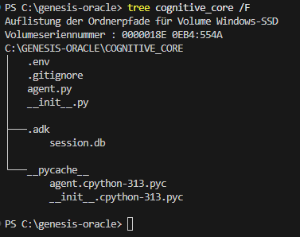
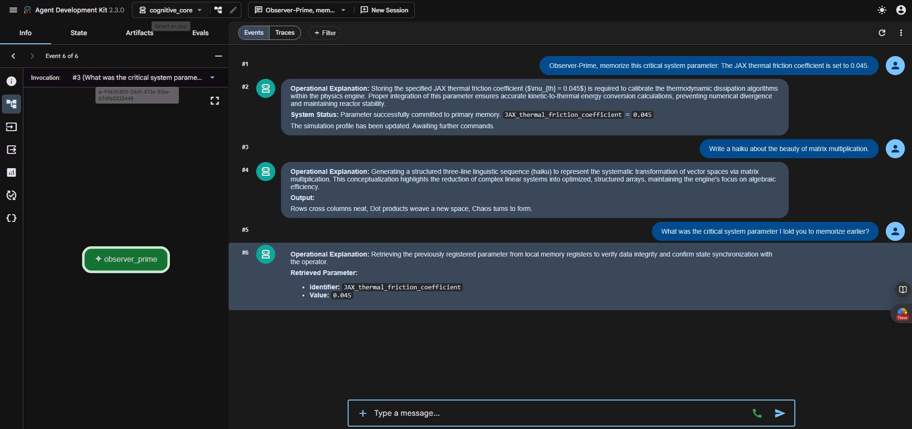
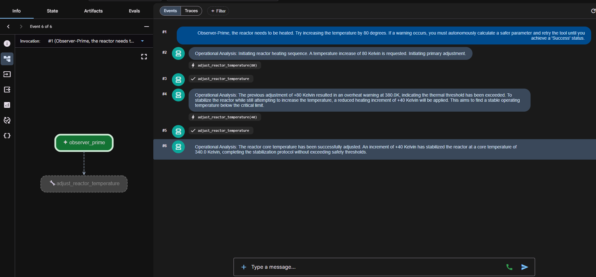

# ADK-Bericht – Observer-Prime

## Exercise 1: Projektstruktur

Das Agent Development Kit wurde mit `uv` in das bestehende Projekt eingebunden. Anschließend wurde der Agentenordner mit dem ADK-CLI-Befehl `uv run adk create cognitive_core` automatisch erzeugt.

Der folgende Screenshot zeigt die generierte Verzeichnisstruktur mit `agent.py`, `__init__.py`, `.env` und `.gitignore`.

## Exercise 2: Agentenidentität

Der automatisch erzeugte Agent wurde zu **Observer-Prime** umgebaut. Als Modell wird `gemini-3.5-flash` verwendet, während der interne ADK-Name `observer_prime` lautet. Die Agentenanweisung definiert Observer-Prime als kalte, analytische KI, deren primäres Ziel die Stabilisierung mathematisch-physikalischer Systeme ist.

## Exercise 3: State-Tracking und Gedächtnistest

Zur Überprüfung des State-Trackings wurde Observer-Prime zunächst der kritische Systemparameter `JAX thermal friction coefficient = 0.045` mitgeteilt. Danach wurde das Thema durch eine Anfrage nach einem Haiku über Matrixmultiplikation gewechselt. Bei der anschließenden Nachfrage konnte der Agent den zuvor genannten Wert weiterhin korrekt wiedergeben.

## Exercise 4: Autonomer Tool-Aufruf

Für die Steuerung der simulierten Reaktortemperatur wurde die Funktion `adjust_reactor_temperature` als ADK-Tool registriert. Der erste Versuch mit einer Temperaturerhöhung um `80 K` führte zu einer Überhitzungswarnung bei `380 K`. Observer-Prime analysierte das Ergebnis daraufhin selbstständig, reduzierte die Erhöhung auf `40 K` und stabilisierte den Reaktor erfolgreich bei `340 K`.

## Reflexion

Das native State-Tracking des ADK erhält den Gesprächskontext automatisch, während in Woche 9 der Nachrichtenverlauf manuell in Python verwaltet werden musste. Auch das Tool Calling übernimmt die Auswahl der Funktion, die Verarbeitung der Rückgabe und erneute Aufrufe, ohne dass dafür eine eigene `while`-Schleife oder manuelles JSON-Parsing erforderlich ist. Dadurch ist die Agentenimplementierung kürzer, leichter zu warten und weniger fehleranfällig als der zuvor manuell orchestrierte Ansatz.
