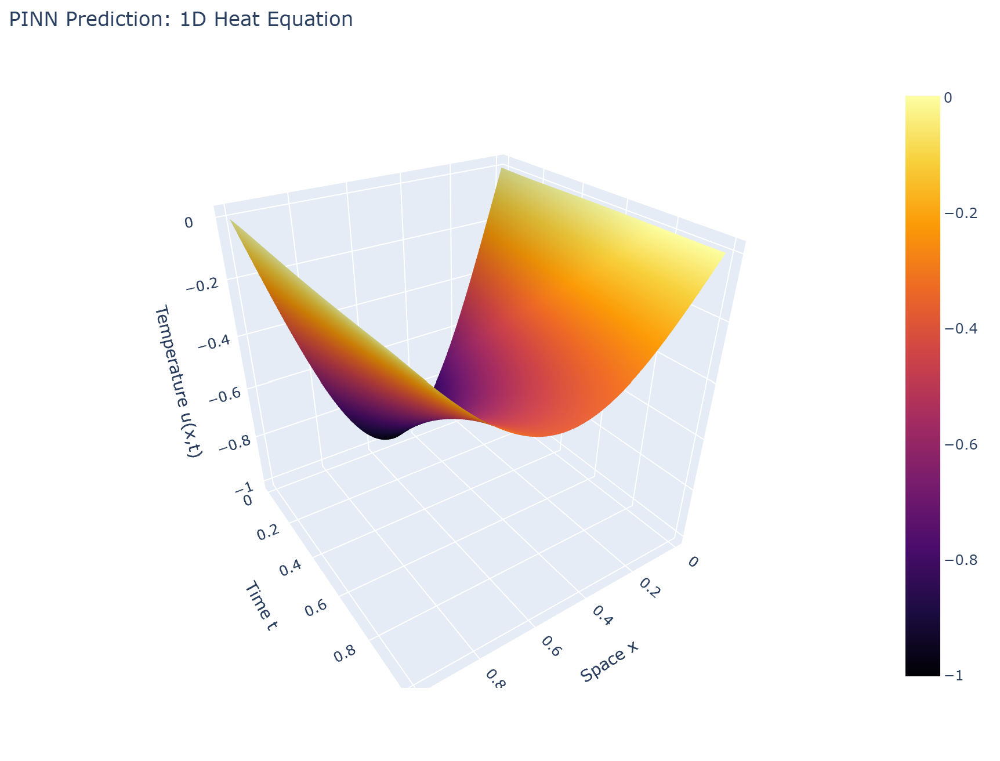

# Fabric Report – PINN Heat Equation

## Kurze Übersicht
Dieses Projekt verwendet ein Physics-Informed Neural Network (PINN), um die eindimensionale Wärmeleitungsgleichung (Heat Equation) zu approximieren. Im Gegensatz zur Verwendung eines festen Finite-Differenzen-Gitters lernt das Modell eine kontinuierliche Funktion u(x,t), die den Temperaturverlauf in Raum und Zeit abbildet.

## PINN-Bedingungen (Constraints)
Das Training des Modells basiert auf drei Verlustkomponenten (Loss Components), die die physikalischen Gesetze durchsetzen:
- **Physics Loss:** Der PDE-Residuumsfehler u_t - alpha * u_xx = 0, der sicherstellt, dass die physikalische Wärmeleitungsgleichung im gesamten Definitionsbereich gilt.
- **Initial Condition Loss (Anfangsbedingung):** Der Fehler zur Startbedingung u(x,0) = -sin(pi*x), der die initiale Temperaturverteilung zum Zeitpunkt t=0 definiert.
- **Boundary Condition Loss (Randbedingungen):** Der Fehler zu den Rändern u(0,t)=0 und u(1,t)=0, der sicherstellt, dass die Temperatur an den Rändern des Bereichs stets null bleibt.

## Interaktive 3D-Visualisierung
Das trainierte PINN wurde auf einem hochauflösenden Raum-Zeit-Gitter (Space-Time-Grid) evaluiert und als 3D-Oberfläche visualisiert, um die Wärmeausbreitung über die Zeit darzustellen.
Die interaktive Visualisierung kann hier aufgerufen werden: [Interaktive 3D-Visualisierung](../public_data/pinn_3d_fabric.html)

## Screenshot der 3D-Oberfläche

## Fourier Neural Operator (FNO)
Ein Fourier Neural Operator löst die Skalierungsgrenzen eines Standard-PINNs auf folgende Weise:
* **Funktion-zu-Funktion-Abbildung:** Ein Standard-PINN lernt eine spezifische Koordinatenabbildung für ein einziges Szenario. Ein FNO hingegen lernt, eine gesamte Eingabe-Funktion (wie eine beliebige Anfangsbedingung) auf eine Ausgabe-Funktion (die Lösung über die Zeit) abzubilden, wodurch es die allgemeinen mathematischen Regeln des Systems erlernt.
* **Die Kraft des Frequenzbereichs:** Durch die Transformation in den Frequenzbereich kann das FNO den gesamten räumlichen Bereich auf einmal erfassen. Dadurch erkennt es großräumige, globale Muster sehr effizient und filtert irrelevantes Rauschen heraus, indem es sich auf die dominanten Frequenzen konzentriert.
* **Zero-Shot-Vorhersagen:** Da das FNO den zugrunde liegenden verallgemeinerten Lösungsoperator der Physik erlernt hat, kann es eine völlig neue, ungesehene Anfangsbedingung erhalten und den zukünftigen Zustand sofort in einem einzigen Vorwärtsdurchlauf berechnen – ganz ohne das langsame und aufwändige Neutrainieren, das bei einem PINN für jedes neue Szenario nötig wäre.

## Kurzes Fazit
Zusammenfassend lässt sich sagen, dass ein PINN hervorragend geeignet ist, um eine spezifische Instanz der Wärmeleitungsgleichung kontinuierlich zu lösen. FNOs sind jedoch deutlich besser skalierbar, da sie Lösungsoperatoren erlernen und somit im Rahmen von Zero-Shot-Vorhersagen auf völlig neue Anfangsbedingungen angewendet werden können.
