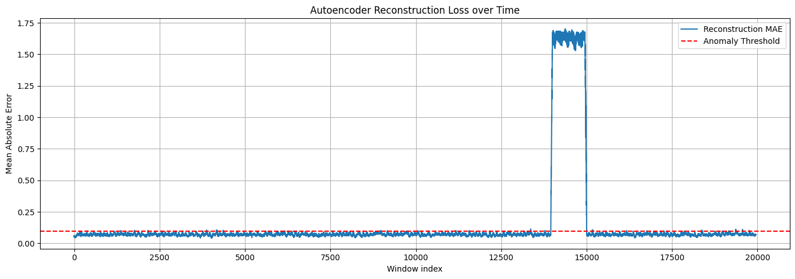

# Agent Report & Genesis Oracle Projekt

**Status:** Simulator-Ausführung, Autoencoder-Training und Conv1D-Refactoring erfolgreich

## Woche 1: Systemsimulation Übersicht

Das Simulationsskript `src/ancients.py` wurde erfolgreich in der vorgesehenen virtuellen Umgebung (`nexus_env`) ausgeführt.

### Simulierte physikalische Systeme

Das Skript analysiert und löst numerisch Differentialgleichungen für zwei klassische physikalische Systeme:

1. **Harmonischer Oszillator:** Ein System 2. Ordnung, das eine idealisierte Schwingungsbewegung modelliert.
2. **Radioaktiver Zerfall:** Ein System 1. Ordnung, das die exponentielle Abnahme einer radioaktiven Substanz über die Zeit modelliert.

### Verifizierung

- **Ausführung:** Das Skript wurde mit Exit-Code 0 ohne fatale Fehler beendet.
- **Generierte Daten:** Die resultierende Visualisierung `plot.png` wurde erfolgreich erstellt und im Verzeichnis `data/` verifiziert.

---

## Woche 3: The Convolutional Horizon (Anomalieerkennung)

### Experiment Übersicht

In diesem Experiment wurde ein Autoencoder zur Erkennung von Anomalien in physikalischen Zeitreihendaten verwendet. Das Signal stammt aus der RC-Filter-Simulation und enthält einen künstlich eingefügten hochfrequenten Spike als Anomalie. Zuerst wurde eine dichte Autoencoder-Architektur (`Dense`) verwendet, anschließend wurde das Modell mithilfe eines KI-Agenten zu einer Conv1D-basierten Architektur refaktoriert.

### Dense Autoencoder Anomalieerkennungs-Workflow

Die ursprüngliche Architektur verwendet vollständig verbundene `Dense`-Schichten, um Zeitreihen-Fenster der Länge 50 in einen latenten Bottleneck der Größe 8 zu komprimieren und anschließend wieder auf die ursprüngliche Fenstergröße zu rekonstruieren. Das Modell wurde nur mit normalen Signaldaten vor der Anomalie trainiert. Dadurch lernt der Autoencoder, die normale Systemdynamik mit niedrigem Rekonstruktionsfehler nachzubilden.

Wenn später eine Anomalie im Signal auftritt, kann das Modell dieses unerwartete Muster schlechter rekonstruieren. Dadurch steigt der Rekonstruktionsfehler stark an. In der Auswertung wurde dafür der Mean Absolute Error (MAE) zwischen Eingangssignal und rekonstruierter Sequenz verwendet.

### Ergebnis der Anomalieerkennung



Im Diagramm bleibt der Rekonstruktionsfehler für die normalen Signalbereiche niedrig und stabil. Im Bereich der künstlich injizierten Anomalie steigt der Fehler deutlich an und überschreitet den roten Schwellenwert. Dadurch wird sichtbar, dass der Autoencoder den abweichenden Signalbereich erfolgreich als Anomalie erkennt.

---

## Conv1D Refactoring

Um die Fähigkeit des Modells zur Verarbeitung von Zeitreihendaten zu verbessern, wurde die ursprüngliche Dense-Architektur mithilfe eines KI-Agenten zu einer Conv1D-basierten Autoencoder-Architektur refaktoriert. Die vollständige Implementierung befindet sich in `src/architecture_conv1d.py`.

### Warum Conv1D besser für Zeitreihendaten geeignet ist

`Conv1D`-Schichten sind für Zeitreihen besser geeignet als reine `Dense`-Schichten, weil sie lokale Muster entlang der Zeitachse erkennen können. Dadurch können kurze Störungen, wiederkehrende Frequenzmuster und lokale Signaländerungen besser erfasst werden. Dense-Schichten behandeln ein Zeitfenster dagegen eher als festen Vektor und verlieren dabei stärker die lokale zeitliche Struktur.

### Erklärung der Tensor-Formen

Eine `Dense`-Schicht verarbeitet typischerweise einen 2D-Tensor der Form `(batch_size, features)`. Eine `Conv1D`-Schicht benötigt dagegen einen 3D-Tensor der Form `(batch_size, time_steps, channels)`. Für ein Zeitfenster der Länge 50 mit einem einzelnen Signalwert pro Zeitpunkt wird die Eingabe daher von `(10, 50)` zu `(10, 50, 1)` umgeformt.

Der Encoder verarbeitet diese Sequenz mit `Conv1D`-Schichten entlang der Zeitachse und komprimiert sie anschließend in einen latenten Raum der Dimension 8. Der Decoder erweitert diesen latenten Vektor wieder, formt ihn zurück zu einer zeitlichen Sequenz und rekonstruiert mit `Conv1DTranspose` wieder ein Signal der Länge 50.

### AI-generierter Conv1D-Codeausschnitt

Der vollständige AI-generierte Conv1D-Autoencoder befindet sich in `src/architecture_conv1d.py`; der folgende Ausschnitt zeigt den Encoder-Teil:

```python
class SignalCompression(layers.Layer):
    def __init__(self, latent_dim=8):
        super().__init__()
        self.latent_dim = latent_dim

    def build(self, input_shape):
        self.conv1 = layers.Conv1D(
            filters=16,
            kernel_size=3,
            strides=2,
            activation="relu",
            padding="same"
        )
        self.conv2 = layers.Conv1D(
            filters=32,
            kernel_size=3,
            strides=1,
            activation="relu",
            padding="same"
        )
        self.flatten = layers.Flatten()
        self.dense = layers.Dense(self.latent_dim, activation="relu")

    def call(self, inputs):
        x = self.conv1(inputs)
        x = self.conv2(x)
        x = self.flatten(x)
        return self.dense(x)
```
### Zusammenfassung

Der Dense-Autoencoder konnte bereits die künstlich eingefügte Anomalie durch einen starken Anstieg des Rekonstruktionsfehlers sichtbar machen. Das Conv1D-Refactoring verbessert die Architektur konzeptionell, weil lokale zeitliche Muster direkt entlang der Signalachse verarbeitet werden. Damit ist die Conv1D-Version besser auf physikalische Zeitreihen und lokale Signalstörungen ausgerichtet.

---

## Woche 5: PINN und die Wärmeleitungsgleichung

In dieser Woche wurde ein Physics-Informed Neural Network (PINN) experimentell eingesetzt, um die eindimensionale Wärmeleitungsgleichung zu approximieren. Im Gegensatz zu klassischen numerischen Verfahren lernt das Modell hierbei eine kontinuierliche Funktion u(x,t).

Weitere Details zum Modell, zu PINN-Verlustfunktionen (Physics, Initial und Boundary Loss) sowie eine Erklärung zu Fourier Neural Operators (FNOs) sind im detaillierten Bericht dokumentiert: [Fabric Report](Fabric_Report.md).

Die Ergebnisse der Approximation sind in einer interaktiven 3D-Darstellung einsehbar: [PINN 3D Fabric](pinn_3d_fabric.html).

## Woche 6: The Chaos Engine – Monte Carlo, Agentic Stress Testing und Markov Chains

In Woche 6 wurde das Projekt um stochastische Simulationen erweitert. Ziel war es, klassische Monte-Carlo-Verfahren mit NumPy, eine massiv vektorisierte JAX-Monte-Carlo-Simulation und eine Markov-Chain-basierte Black-Swan-Simulation umzusetzen. Dabei wurde untersucht, wie Unsicherheit, Kostenrisiken und makroökonomische Zustandswechsel die Stabilität eines simulierten Unternehmens beeinflussen können.

### Classical Monte Carlo Pi Estimation

Zunächst wurde mit `src/classical_pi.py` eine klassische NumPy-basierte Monte-Carlo-Schätzung von Pi umgesetzt. Dabei wurden zufällige Punkte im Einheitsquadrat erzeugt und geprüft, ob sie innerhalb des Viertelkreises liegen. Der daraus berechnete Pi-Wert lag bei ungefähr `3.141736`, bei einer gemessenen Ausführungszeit von etwa `0.2262` Sekunden.


### JAX Monte Carlo Revenue Simulation

Anschließend wurde mit `src/monte_carlo.py` eine JAX-basierte Monte-Carlo-Simulation für ein stochastisches Geschäftsmodell erstellt. Die Simulation verwendet 1.000.000 parallele Pfade und modelliert Marktnachfrage, Produktionskosten und regulatorische Strafraten als Zufallsvariablen. Daraus wurden der erwartete Umsatz und der Value-at-Risk berechnet.

Die gemessenen Ergebnisse waren:

* Erwarteter Umsatz: `149751.71875`
* Value-at-Risk 95%-Schwelle: `112734.46875`


### Agentic Stress Testing mit Antigravity

Für den agentischen Stresstest wurde Antigravity genutzt, um den Monte-Carlo-Code automatisiert analysieren zu lassen. Subagent-Alpha untersuchte dabei, ab welchem Sigma-Wert der Log-Normal-Kostenverteilung der VaR 95% unter null fällt. Subagent-Beta analysierte die JAX-Ausführungszeiten und verglich den initialen Kompilierungslauf mit dem zweiten warmen Lauf.

Der vollständige Report befindet sich hier:

[Swarm Stress Report](Swarm_Stress_Report.md)

### Markov Boss Fight: Black Swan Simulation

Für die Markov-Chain-Simulation wurde **Module Alpha (The Matrix Carrier)** gewählt. Dabei wird ein aggregierter Wahrscheinlichkeitsvektor mit `jax.lax.scan` über 365 Tage fortgeschrieben. Die drei Zustände sind:

1. Bull Market
2. Stagnation
3. Catastrophic Recession

Während des Black-Swan-Schocks zwischen Tag 180 und Tag 190 wird ein großer Teil der Wahrscheinlichkeit aus Bull Market und Stagnation in die Catastrophic Recession verschoben. Nach dem Schock kehrt die Simulation zur Basismatrix zurück, wodurch eine teilweise Erholung sichtbar wird.

Die gemessene Verteilung direkt nach dem Schock an Tag 190 war:

* Bull Market: `6.19%`
* Stagnation: `17.62%`
* Catastrophic Recession: `76.19%`

Die finale Verteilung an Tag 365 war:

* Bull Market: `34.57%`
* Stagnation: `38.30%`
* Catastrophic Recession: `27.13%`


Wenn die Zufallsvariablen aus der Monte-Carlo-Simulation direkt an diese Markov-Zustände gekoppelt wären, würde die Cash-Flow-Struktur während des Rezessionsspikes stark einbrechen. In einer Catastrophic Recession wären Nachfrage, Kosten und regulatorische Risiken gleichzeitig ungünstiger, wodurch der erwartete Umsatz sinken und der Value-at-Risk deutlich schlechter ausfallen würde. Besonders gefährlich wäre die Kombination aus sinkender Nachfrage und steigenden Extremkosten, weil dadurch selbst zuvor stabile Umsatzverteilungen in den Verlustbereich kippen könnten.

### Zusammenfassung

Die Chaos Engine zeigt, wie klassische Zufallssimulationen, JAX-basierte Parallelisierung, agentische Analyse und Markov Chains zusammen genutzt werden können, um stochastische Risiken zu untersuchen. Während die Monte-Carlo-Simulation einzelne wirtschaftliche Unsicherheiten modelliert, erweitert die Markov Chain das System um zeitabhängige makroökonomische Zustandswechsel. Dadurch wird sichtbar, wie ein Black-Swan-Ereignis kurzfristig extreme Risiken erzeugt und wie sich das System danach nur langsam erholt.
